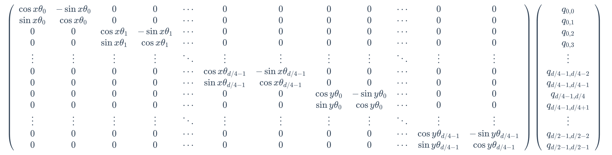

# rope_2d

[English](README.md) | 简体中文

## 1. 背景

在NLP中，语言的位置信息是一维的，换句话说，我们需要告诉模型这个词是句子的第几个词；但是在CV中，图像的位置信息是二维的，即我们需要告诉模型这个特征是在第几行、第几列。这里的二维指的是完整描述位置信息需要两个数字，并不是指位置向量的维数。

如果直接使用Transformer的位置编码，会导致模型无法区分不同位置的特征，因此需要引入二维位置编码。

## 2. 1d 与 2d Rope 对比

假设 q 的纬度是 4，一维的位置编码是这样的：

$$
f(q, m) = R_mq = \left(\begin{array}{cc:cc}
\cos m \theta & -\sin m \theta & 0 & 0 \\
\sin m \theta & \cos m \theta & 0 & 0 \\
\hdashline 0 & 0 & \cos m \theta & -\sin m \theta \\
0 & 0 & \sin m \theta & \cos m \theta
\end{array}\right) \left(\begin{array}{c} q_0 \\ q_1 \\ q_2 \\ q_3 \end{array}\right)
$$

扩展到多维后的公式如下：

$$
\left(\begin{array}{ccccccc}
\cos m \theta_0 & -\sin m \theta_0 & 0 & 0 & \cdots & 0 & 0 \\
\sin m \theta_0 & \cos m \theta_0 & 0 & 0 & \cdots & 0 & 0 \\
0 & 0 & \cos m \theta_1 & -\sin m \theta_1 & \cdots & 0 & 0 \\
0 & 0 & \sin m \theta_1 & \cos m \theta_1 & \cdots & 0 & 0 \\
\vdots & \vdots & \vdots & \vdots & \ddots & \vdots & \vdots \\
0 & 0 & 0 & 0 & \cdots & \cos m \theta_{d / 2-1} & -\sin m \theta_{d / 2-1} \\
0 & 0 & 0 & 0 & \cdots & \sin m \theta_{d / 2-1} & \cos m \theta_{d / 2-1}
\end{array}\right)\left(\begin{array}{c}
q_0 \\
q_1 \\
q_2 \\
q_3 \\
\vdots \\
q_{d-2} \\
q_{d-1}
\end{array}\right)
$$

上面的稀疏矩阵可以简化为：

$$
\left(\begin{array}{c}
q_0 \\
q_1 \\
q_2 \\
q_3 \\
\vdots \\
q_{d-2} \\
q_{d-1}
\end{array}\right) \otimes\left(\begin{array}{c}
\cos m \theta_0 \\
\cos m \theta_0 \\
\cos m \theta_1 \\
\cos m \theta_1 \\
\vdots \\
\cos m \theta_{d / 2-1} \\
\cos m \theta_{d / 2-1}
\end{array}\right)+\left(\begin{array}{c}
-q_1 \\
q_0 \\
-q_3 \\
q_2 \\
\vdots \\
-q_{d-1} \\
q_{d-2}
\end{array}\right) \otimes\left(\begin{array}{c}
\sin m \theta_0 \\
\sin m \theta_0 \\
\sin m \theta_1 \\
\sin m \theta_1 \\
\vdots \\
\sin m \theta_{d / 2-1} \\
\sin m \theta_{d / 2-1}
\end{array}\right)
$$

二维位置编码可以简单的理解为，将一维的位置编码在两个方向上分别计算，然后拼接在一起。最后得出的二维位置编码。q 是 4 维的情况如下：

$$
f(q, x, y) = R_{xy}q = \left(\begin{array}{cc:cc}
\cos x \theta & -\sin x \theta & 0 & 0 \\
\sin x \theta & \cos x \theta & 0 & 0 \\
\hdashline 0 & 0 & \cos y \theta & -\sin y \theta \\
0 & 0 & \sin y \theta & \cos y \theta
\end{array}\right) \left(\begin{array}{c} 
q_{0,0} \\ 
q_{0,1} \\ 
q_{1,0} \\ 
q_{1,1} 
\end{array}\right)
$$

扩展到多维后的公式如下：

  

当然了，这个稀疏矩阵也可以简化为：

$$
\left(\begin{array}{c}
q_{0,0} \\
q_{0,1} \\
q_{0,2} \\
q_{0,3} \\
\vdots \\
q_{d/4-1,d/4-2} \\
q_{d/4-1,d/4-1} \\
q_{d/4-1,d/4} \\
q_{d/4-1,d/4+1} \\
\vdots \\
q_{d/2-1,d/2-2} \\
q_{d/2-1,d/2-1}
\end{array}\right) \otimes\left(\begin{array}{c}
\cos x \theta_0 \\
\cos x \theta_0 \\
\cos x \theta_1 \\
\cos x \theta_1 \\
\vdots \\
\cos x \theta_{d / 4-1} \\
\cos x \theta_{d / 4-1} \\
\cos y \theta_0 \\
\cos y \theta_0 \\
\vdots \\
\cos y \theta_{d / 4-1} \\
\cos y \theta_{d / 4-1}
\end{array}\right)+\left(\begin{array}{c}
-q_{0,1} \\
q_{0,0} \\
-q_{0,3} \\
q_{0,2} \\
\vdots \\
-q_{d/4-1,d/4-2} \\
q_{d/4-1,d/4-1} \\
-q_{d/4-1,d/4} \\
q_{d/4-1,d/4+1} \\
\vdots \\
-q_{d/2-1,d/2-2} \\
q_{d/2-1,d/2-1}
\end{array}\right) \otimes\left(\begin{array}{c}
\sin x \theta_0 \\
\sin x \theta_0 \\
\sin x \theta_1 \\
\sin x \theta_1 \\
\vdots \\
\sin x \theta_{d / 4-1} \\
\sin x \theta_{d / 4-1} \\
\sin y \theta_0 \\
\sin y \theta_0 \\
\vdots \\
\sin y \theta_{d / 4-1} \\
\sin y \theta_{d / 4-1}
\end{array}\right)
$$

可以看到，二维位置编码的计算方式和一维的计算方式是一样的，只是在两个方向上分别计算，然后拼接在一起。从实现角度来说，只需要修改计算 sin，cos 的相关逻辑即可。